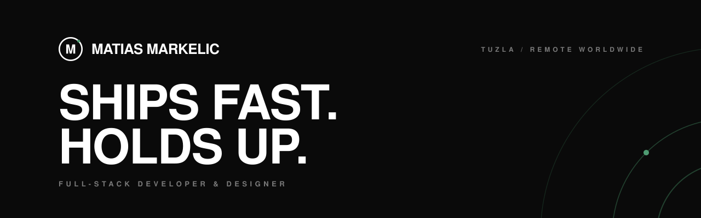

<picture>
  <source media="(prefers-color-scheme: dark)" srcset="assets/banner-dark.svg">
  <source media="(prefers-color-scheme: light)" srcset="assets/banner-light.svg">
  
</picture>

   

 **Available for work** &nbsp;·&nbsp; Tuzla, BiH &nbsp;·&nbsp; remote worldwide &nbsp;·&nbsp; [30 minutes, no pitch](https://cal.com/matias-markelic)

Ten years shipping production code. I build web applications that go live on time and stay stable when traffic grows, for startups and agencies, from zero to one or on foundations that already exist.

Fifteen commercial projects shipped. Three public repositories here; most of the work lives on client infrastructure.

 

## 01 &nbsp;/&nbsp; WHAT I DO

<table>
  <tr>
    <td><b>Web application dev</b></td>
    <td>Full-cycle development in modern frameworks. Performance and SEO included, not quoted separately.</td>
  </tr>
  <tr>
    <td><b>System architecture</b></td>
    <td>Backend and databases that survive growth. Modular monolith or microservices: decided by the load, not the trend.</td>
  </tr>
  <tr>
    <td><b>API integration</b></td>
    <td>Stripe, Twilio, OpenAI wired into real business logic.</td>
  </tr>
  <tr>
    <td><b>AI implementation</b></td>
    <td>LLMs, agents, automation, custom AI workflows in production.</td>
  </tr>
</table>

 

## 02 &nbsp;/&nbsp; SELECTED WORKS

| Project | What it is | Stack |
|---|---|---|
| [**BlueStormAI**](https://www.mqrkelich.com/project/bluestormai) | Platform for an AI agency building production agents for support, sales and lead qualification. | Next.js · React · TypeScript · AI integrations |
| [**Riatic.de**](https://www.mqrkelich.com/project/riaticde) | AI automation agency — founder and lead developer. | Next.js · React · TypeScript |
| [**Fuego Digital**](https://www.mqrkelich.com/project/fuego-digital) | Independent music distribution platform: global publishing, performance tracking, payouts. | Next.js · React · TypeScript |
| [**Artifex**](https://www.mqrkelich.com/project/artifex) | Full-stack work at Artifex.gg across backend services and product features. | Next.js · React · TypeScript |
| [**AthloBase**](https://www.mqrkelich.com/project/athlobase) | Central platform for managing sports clubs and teams. Built for Hack Club's Neighborhood. | Next.js · React · TypeScript |
| [**Flamenco Tuzla**](https://www.mqrkelich.com/project/flamenco-tuzla) | Landing page plus admin dashboard — staff manage blogs, classes and content themselves. | Next.js · React · TypeScript |
| [**Peregrine Plitvice Lakes**](https://www.mqrkelich.com/project/peregrine-plitvice-lakes) | Digital experience for a five-star private villa. | Next.js · Tailwind CSS · Vercel |
| [**SIMPRO KANT**](https://www.mqrkelich.com/project/simpro-kant) | Site for a cutting and edge-banding business, with AI integration. | Next.js · React · AI integration |

<b>All projects (15)</b>

 

| Project | What it is | Stack |
|---|---|---|
| [Perišić Holding](https://www.mqrkelich.com/project/perii-holding) | Digital platform for a modern building and energy company. | Next.js · React · TypeScript |
| [BELU Lounge Bar](https://www.mqrkelich.com/project/belu-lounge-bar) | Digital experience for a lounge bar in Karlovac. | Next.js · React · TypeScript |
| [SolarShine](https://www.mqrkelich.com/project/solarshine) | Croatian service for professional solar panel cleaning. | Next.js · React · TypeScript |
| [RSN Vision](https://www.mqrkelich.com/project/rsn-vision) | Landing page carrying the brand's visual identity. | Next.js · TypeScript · Tailwind CSS |
| [Struktar](https://www.mqrkelich.com/project/struktar) | Site for a digital agency doing web, marketing and SEO. | Next.js · React · MongoDB |
| [BubbleNodes](https://www.mqrkelich.com/project/bubblenodes) | Static marketing site — layout, responsiveness, load speed. | HTML · CSS · Cloudflare |
| [BlueFoxHost](https://www.mqrkelich.com/project/bluefoxhost) | Marketing site redesign: cleaner layout, better perceived performance. | HTML · CSS · Cloudflare |

Full archive → [mqrkelich.com/projects](https://www.mqrkelich.com/projects)

 

## 03 &nbsp;/&nbsp; STACK

Plus system architecture and UI/UX — the parts that don't have a logo.

 

## 04 &nbsp;/&nbsp; CONTACT

<table>
  <tr><td>Booking</td><td><a href="https://cal.com/matias-markelic">cal.com/matias-markelic</a></td></tr>
  <tr><td>Mail</td><td><a href="mailto:matias@mqrkelich.com">matias@mqrkelich.com</a></td></tr>
  <tr><td>Web</td><td><a href="https://www.mqrkelich.com">mqrkelich.com</a></td></tr>
  <tr><td>LinkedIn</td><td><a href="https://www.linkedin.com/in/mqrkelich/">in/mqrkelich</a></td></tr>
  <tr><td>Instagram</td><td><a href="https://www.instagram.com/mqrkelich/">@mqrkelich</a></td></tr>
  <tr><td>X</td><td><a href="https://twitter.com/mqrkelich">@mqrkelich</a></td></tr>
</table>

 

MATIAS MARKELIC &nbsp;·&nbsp; FULL-STACK DEVELOPER &amp; DESIGNER &nbsp;·&nbsp; TUZLA / REMOTE WORLDWIDE
